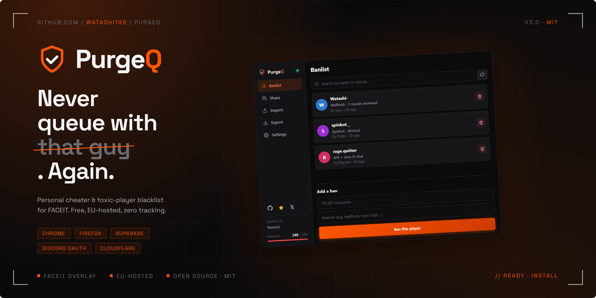

  

PurgeQ lets you flag players you never want to queue with again. Banned
players are highlighted directly on FACEIT profiles, lobbies, party and
match rooms, so you can avoid known trolls before the game starts.

---

## ⚡ What it does

- 🔴 **Live highlight** — flagged players visually marked on FACEIT cards
- ⚡ **One-click ban** — add a player from any card with a reason
- 🤝 **Shared banlists** — generate an invite link and let friends / teammates
  read or edit your list (viewer or editor role)
- 📥 **Import / Export** — JSON or CSV, dedup'd server-side
- 🔄 **Real-time sync** — popup mutations propagate to open FACEIT tabs
- 🌍 **7 languages** — EN, FR, PT-BR, RU, TR, ES, DE

---

## 🚀 Get started

PurgeQ is a hosted SaaS. There's nothing to install on a server — just
add the extension:

- **Chrome / Edge** — install from the Chrome Web Store
- **Firefox** — install from addons.mozilla.org

Click the extension icon, sign in with Discord, and you're done. Your
"Personal Banlist" is created automatically.

---

## 🧠 Architecture

The whole stack is serverless on managed infrastructure:

- **Extension** — TypeScript + React, built with Vite, MV3 service worker
- **Backend** — Supabase (Postgres + Auth + RPC). Row Level Security
  enforces per-tenant isolation; no application-layer access checks.
- **Auth** — Supabase Auth with Discord OAuth, gated by Cloudflare
  Turnstile for bot protection
- **Landing + auth bridge page** — static, hosted on Cloudflare Pages

See [`extension/`](extension/), [`supabase/migrations/`](supabase/migrations/)
and [`landing/`](landing/) for the source. [`landing/auth/`](landing/auth/)
contains the small page that runs the Turnstile challenge before
handing off to Supabase + Discord OAuth.

---

## 🧩 Usage

- Hover a FACEIT player card → **Ban / Unban** pill
- Open the popup → **Banlist** tab to manage entries, **Share** to invite
  others, **Import / Export** for bulk operations
- **Settings** has language, default author name, and GDPR controls
  (export your data / delete your account)

---

## 🔐 Privacy

PurgeQ stores only what's needed for the banlist feature:

- Your Discord ID + display name (from OAuth)
- Banlist entries you create (FACEIT nickname, reason, author)
- Banlists shared with you

No analytics, no ad tracking, no fingerprinting. Full details in
[PRIVACY.md](PRIVACY.md). Use **Settings → Your data → Export my data**
to download everything we store about you as JSON, or **Delete account**
to wipe it.

---

## ⚠️ Disclaimer

PurgeQ is a community-driven tool. It does not modify FACEIT servers —
only the client-side visibility of player cards.

## ⭐ Support the project

If you like PurgeQ:

- ⭐ Star the repo
- 🧠 Share it with teammates
- 🤝 Open an issue or PR
